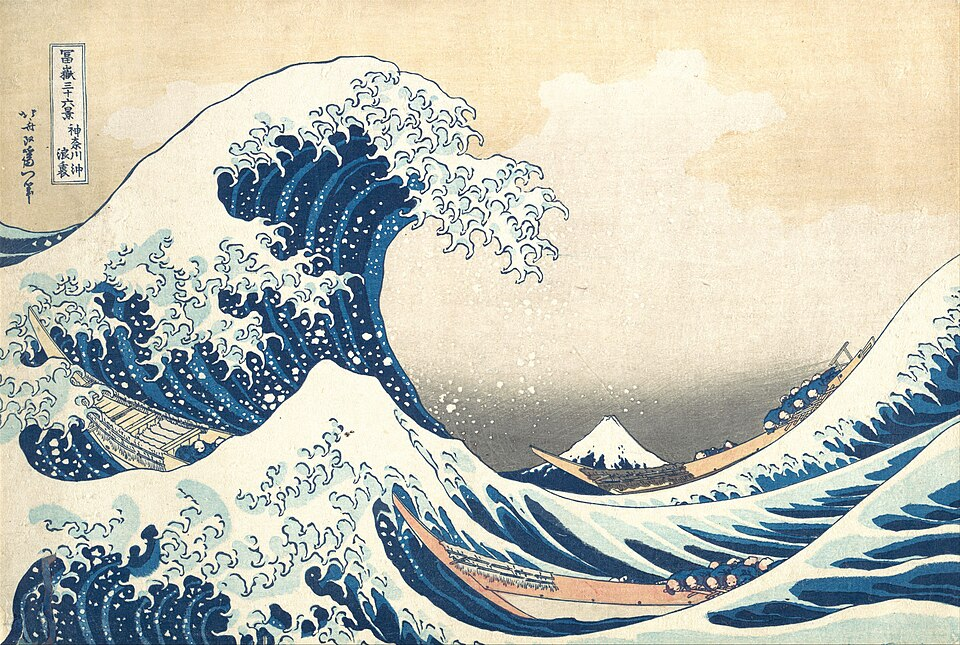

<!-- This file conforms to the Standard Readme Style -->

# Personal Website

<!-- INSERT BANNER HERE -->

<!-- INSERT BADGES HERE -->

This my personal website, built with Zola, containing information about me, useful links, my resume and some blog posts. Includes a Fediverse linked comment section!

## Roadmap

- [x] Landing Page
- [x] Icon on the web
- [x] About Page
- [x] Links Page
- [x] Blogs Section
- [x] Templates to create Blog posts
- [x] Dark/Light Mode
- [x] Proper metadata and good SEO
- [x] RSS/Atom feed
- [x] Write the First Post
- [x] Make image for link sharing
- [x] Implement webmentions
- [x] Fix font problems in mobile
- [ ] Make a portuguese version
- [ ] Mastodon Comments

 ## Acknowledgements 
 
 - [Gabriel Monteiro's Website](https://gabrielsouza.top/)
 - [Marcus Obst's Website](https://marcus-obst.de/)
 - Built with [Zola](https://getzola.org)
 - Built with [Pico CSS](https://picocss.com)

## Contributing

If you find any problem with this project or has a suggestion, feel free to [Open a New Issue](/issues/new) or [Submit a Pull Request](/compare).

## License

The source code is under the MIT license, for more info see [LICENSE](LICENSE). All the content is under the Creative Commons License, see [CC-BY-SA-4.0](static/LICENSE-CC-BY-SA-4) for more.

This file was made with [Make Your Reads](https://github.com/caio-bernardo/make-your-reads).
